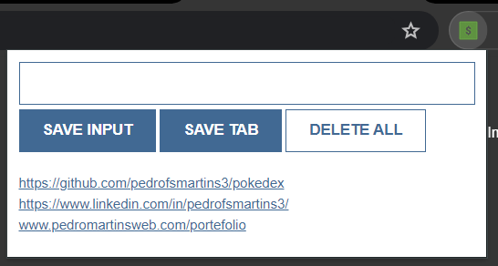

This is a Google extension called “Leads Stack”.

This extension captures the URL of the lead you want. You can type the URL yourself or grab the tab URL from the Chrome windows you are in.

Leads accumulate in the extension and are automatically saved to your local storage. You can close and open chrome and the leads will still be there. You can remove all locally stored leads by double-clicking the Remove button.

I saw a video of Scrimba's CEO building this extension and I copied it to create my own. I just changed a few things for my personal touch.

I hope you like it!

